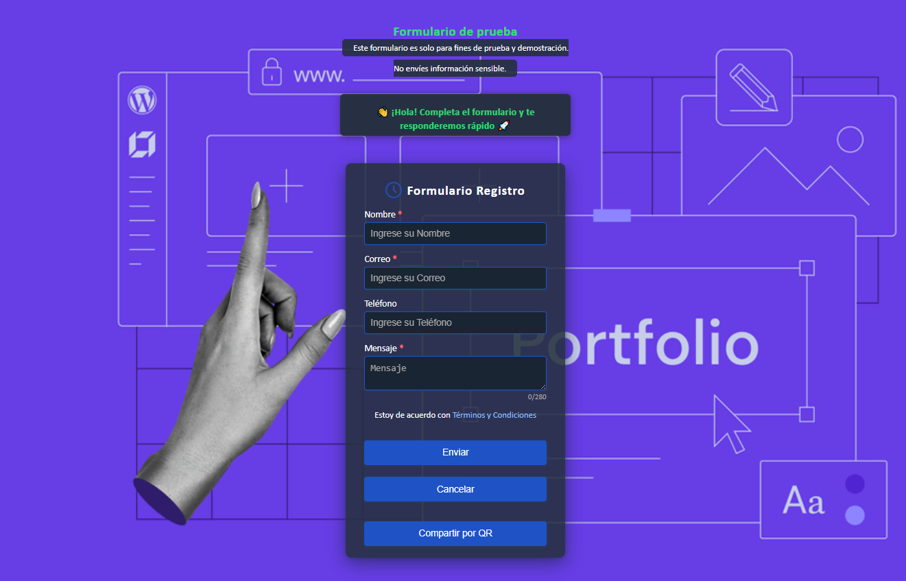

# Formulario de Prueba con QR, Animaciones y Deploy en Netlify

Este repositorio fue desarrollado por **Amet Marcelo Quispe**.  
Contiene un **formulario de registro/contacto** moderno, con validación avanzada, animaciones suaves y funcionalidades UX/UI mejoradas. Es ideal para demostrar habilidades de front-end y para pruebas con [FormSubmit.co](https://formsubmit.co/).

---

## 📸 Captura de pantalla

¡Así se ve el formulario en acción!

<p align="center">
  
</p>


---

## 🚀 Demo Rápida

- **Visualmente atractivo:**  
  Fondo personalizado, animaciones suaves, validación visual y mensajes instantáneos.
- **Funcionalidades extra:**  
  Modal de privacidad, código QR para compartir/regresar, slide-to-send móvil, honeypot anti-bots, spinner de carga, toast de notificaciones, página de gracias con check y QR.
- **Tecnologías:**  
  HTML5, CSS3 (responsive), JavaScript vanilla, Qrious (QR), FormSubmit.co (emails).

---

## 📁 Estructura de Archivos

/css/style.css # Estilos modernos y responsivos
/img/fondo.webp # Imagen de fondo (puedes usar la que quieras)
captura.jpg # Captura de pantalla del proyecto (para este README)
/index.html # Página principal del formulario
/gracias.html # Página de confirmación/éxito tras enviar
/README.md # (Este archivo)

yaml
Copiar
Editar


---

## ⚙️ ¿Cómo usarlo?

1. **Clona o descarga este repositorio**

   ```bash
   git clone https://github.com/tu-usuario/tu-repo-formulario.git
   cd tu-repo-formulario
